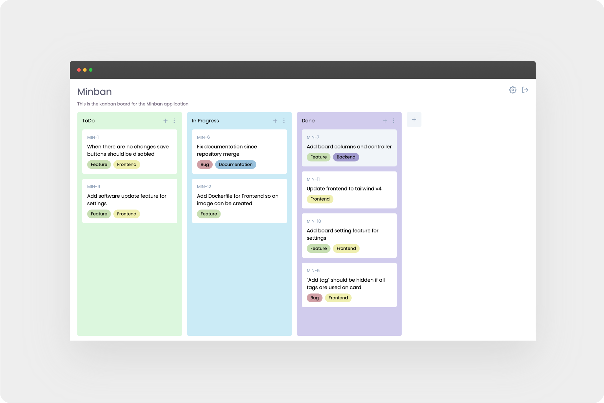

<div align="center">

# Minban

*A minimalist Kanban board application built with modern web technologies*

[](https://golang.org/)
[](https://dioxuslabs.com/)
[](https://webassembly.org/)
[](https://tailwindcss.com/)



</div>

## Description

MinBan is a sleek, lightweight Kanban board application that helps you organize your tasks and projects efficiently. Built with a Go backend and a Rust/Dioxus frontend, it offers a fast and responsive user experience.

## Motivation

The motivation behind MinBan was to create a Kanban application that is **incredibly simple** and **highly customizable**.

**This is not intended for teams or real Kanban project management!**
 
 It's designed for individual users who simply enjoy the Kanban approach to organizing their personal tasks and projects.

The goal was to build something that:
- Stays out of your way while organizing your thoughts
- Offers clean customization without complexity
- Focuses on personal use rather than team collaboration
- Maintains simplicity over feature bloat

## Features

- **Intuitive Kanban Interface**: Drag and drop cards between columns
- **Board Management**: Create and manage multiple boards
- **Card Organization**: Add, edit, and delete cards with ease
- **Tag System**: Organize cards with customizable tags
- **User Authentication**: Secure login system with JWT tokens

## Quick Start

### Prerequisites
- Go 1.23+ and Rust with cargo
- Docker (optional)

### Development Setup

```bash
# Clone the repository
git clone https://github.com/snekussaurier/minban.git
cd minban

# Backend
cd backend/src
go mod download
go run main.go  # Starts on port 9916

# Frontend (in new terminal)
cd frontend
dx serve  # Available at http://localhost:8080
```

### Docker Setup

```bash
cd backend
docker-compose up
```

Default credentials: `snekussaurier` / `123`

## License

This project is licensed under the AGPL 3.0 License - see the [LICENSE](../LICENSE) file for details.

## Contributing

Contributions are welcome! Please feel free to submit a Pull Request.
